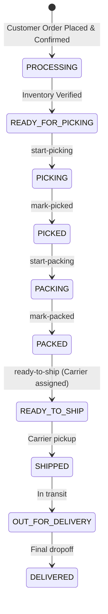

# Backend Milestone 6 — Warehouse Management Module

## Overview
The **Warehouse Management Module** provides an enterprise fulfillment and inventory control system for ShopStack. Warehouse personnel (`ROLE_WAREHOUSE_STAFF`) and system administrators (`ROLE_ADMIN`) have real-time visibility and control over stock quantities, inventory thresholds, picking/packing queues, and carrier dispatch staging.

---

## 1. Domain Entities & Database Schema

### `Inventory`
| Column | Type | Constraints | Description |
|---|---|---|---|
| `id` | BIGINT | PK, Auto-increment | Unique identifier |
| `product_id` | BIGINT | FK to `products`, UNIQUE, NOT NULL | Associated catalog product |
| `total_stock` | INTEGER | NOT NULL, >= 0 | Total physical units in warehouse |
| `reserved_stock` | INTEGER | NOT NULL, >= 0 | Units committed to pending customer orders |
| `available_stock` | INTEGER | NOT NULL, >= 0 | Units available for sale (`totalStock - reservedStock`) |
| `low_stock_threshold` | INTEGER | NOT NULL, Default: 10 | Stock level that triggers restock warning |
| `version` | INTEGER | NOT NULL, `@Version` | Optimistic locking token preventing concurrent stock anomalies |
| `created_at` / `updated_at` | TIMESTAMP | NOT NULL | Timestamps |

### `StockMovement`
| Column | Type | Constraints | Description |
|---|---|---|---|
| `id` | BIGINT | PK, Auto-increment | Movement identifier |
| `product_id` | BIGINT | FK to `products`, NOT NULL | Product experiencing movement |
| `movement_type` | VARCHAR | NOT NULL | Enum (`IN`, `OUT`, `ADJUSTMENT`, `RESERVED`, `RELEASED`, `RETURN`, `DAMAGE`, `CORRECTION`, `STOCK_IN`, `STOCK_OUT`) |
| `quantity` | INTEGER | NOT NULL | Number of units moved |
| `previous_stock` | INTEGER | NOT NULL | Stock before mutation |
| `new_stock` | INTEGER | NOT NULL | Stock after mutation |
| `reference_id` | VARCHAR | NULL | External reference (Order #, PO #, RMA #) |
| `notes` | VARCHAR(500) | NULL | Justification / Reason |
| `performed_by` | BIGINT | FK to `users`, NULL | Staff member who triggered movement |
| `created_at` | TIMESTAMP | NOT NULL | Audit timestamp |

---

## 2. Security & RBAC Boundaries

| Endpoint Pattern | Method | Allowed Roles | Description |
|---|---|---|---|
| `/api/warehouse/dashboard` | `GET` | `WAREHOUSE_STAFF`, `ADMIN` | High-level KPI operational statistics |
| `/api/warehouse/inventory` | `GET`, `POST` | `WAREHOUSE_STAFF`, `ADMIN` | List and search inventory catalog |
| `/api/warehouse/inventory/low-stock` | `GET` | `WAREHOUSE_STAFF`, `ADMIN` | Low-stock alert catalog |
| `/api/warehouse/inventory/out-of-stock` | `GET` | `WAREHOUSE_STAFF`, `ADMIN` | Out-of-stock items |
| `/api/warehouse/inventory/{productId}` | `GET` | `WAREHOUSE_STAFF`, `ADMIN` | Single SKU inventory detail |
| `/api/warehouse/inventory/{productId}/add` | `POST` | `WAREHOUSE_STAFF`, `ADMIN` | Inbound stock replenishment |
| `/api/warehouse/inventory/{productId}/adjust` | `POST` | `WAREHOUSE_STAFF`, `ADMIN` | Multi-mode stock adjustments (`ADD`, `REMOVE`, `DAMAGE`, `CORRECTION`, `SET`) |
| `/api/warehouse/inventory/{productId}/threshold` | `PUT` | `WAREHOUSE_STAFF`, `ADMIN` | Update low stock alert threshold |
| `/api/warehouse/stock-movements` | `GET` | `WAREHOUSE_STAFF`, `ADMIN` | Paginated immutable audit trail |
| `/api/warehouse/picking/orders` | `GET` | `WAREHOUSE_STAFF`, `ADMIN` | Orders awaiting physical item retrieval |
| `/api/warehouse/packing/orders` | `GET` | `WAREHOUSE_STAFF`, `ADMIN` | Picked orders awaiting packing & inspection |
| `/api/warehouse/ready-to-ship/orders` | `GET` | `WAREHOUSE_STAFF`, `ADMIN` | Packed orders staged for carrier dispatch |
| `/api/warehouse/orders/{orderId}/start-picking` | `POST` | `WAREHOUSE_STAFF`, `ADMIN` | Move order to `PICKING` status |
| `/api/warehouse/orders/{orderId}/mark-picked` | `POST` | `WAREHOUSE_STAFF`, `ADMIN` | Move order to `PICKED` status |
| `/api/warehouse/orders/{orderId}/start-packing` | `POST` | `WAREHOUSE_STAFF`, `ADMIN` | Move order to `PACKING` status |
| `/api/warehouse/orders/{orderId}/mark-packed` | `POST` | `WAREHOUSE_STAFF`, `ADMIN` | Seal package with dimensions and move to `PACKED` |
| `/api/warehouse/orders/{orderId}/ready-to-ship` | `POST` | `WAREHOUSE_STAFF`, `ADMIN` | Assign carrier, generate tracking #, mark `READY_TO_SHIP` |

- **Customer / Vendor Access**: Returns `403 Forbidden`.
- **Unauthenticated Access**: Returns `401 Unauthorized`.

---

## 3. Warehouse Fulfillment State Machine

---

## 4. Verification Results
- **Backend Tests**: `290 / 290 tests passed` (`0 Failures, 0 Errors, 0 Skipped`).
- **Frontend Build**: `npm run build` completed with 0 errors (`1710 modules transformed`).
