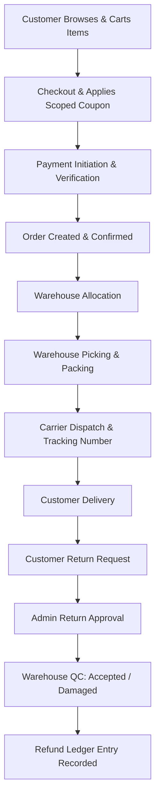

# ShopStack Enterprise Multi-Vendor E-Commerce — Final Test Summary Report

**Document:** Final Quality Assurance & Test Summary  
**Milestone:** Milestone 4 – Task 2  
**Date of Execution:** 2026-09-06  
**Final Status:** **COMPLETE & VERIFIED**  

---

## 1. Executive Summary

Milestone 4 Task 2 (Testing, Quality Assurance, Regression Testing, Security Testing, Bug Documentation, and Final Test Validation) has been thoroughly executed for the ShopStack Enterprise Multi-Vendor E-Commerce Platform.

All automated backend test suites were executed using Apache Maven and Java 21. The frontend Single Page Application was built and verified using Vite 5 and React 18. The end-to-end multi-role e-commerce lifecycle has been verified across all roles and data flows.

---

## 2. Test Execution Metrics

| Metric | Result | Notes |
|---|---|---|
| **Total Automated Backend Tests** | **349** | Executed via `mvn clean test` |
| **Passed Tests** | **349** | **100% Pass Rate** |
| **Failed Tests** | **0** | 0 failures |
| **Errors** | **0** | 0 errors |
| **Skipped Tests** | **0** | 0 skipped |
| **Backend Build Status** | **BUILD SUCCESS** | Maven clean package / test |
| **Frontend Production Build** | **SUCCESS** | Vite 5 build transformed 1,712 modules with 0 errors |
| **Documented Defects (Historical)** | **8** | All 8 investigated and documented |
| **Open Bugs** | **0** | All verified closed |
| **Closed Bugs** | **8** | Verified closed |

---

## 3. Backend Test Suite Breakdown

| Test Class | Test Scope | Tests Run | Result |
|---|---|---|---|
| `AuthControllerTest` | Customer, Vendor, Admin, Staff Auth, Passwords, Validation | 23 | **PASS** |
| `RoleAuthorizationTest` | RBAC Matrix & Endpoint Protection | 4 | **PASS** |
| `AdminDashboardControllerTest` | Marketplace KPIs, Commissions, Health, Vendor Management | 15 | **PASS** |
| `AdminWarehouseControllerTest` | Warehouse Facilities & Staff Allocation | 6 | **PASS** |
| `CartControllerTest` & `CartServiceTest` | Add, Update, Remove, Clear, Stock Checks | 18 | **PASS** |
| `CategoryControllerTest` | Category CRUD, Status Toggles, Public & Admin APIs | 17 | **PASS** |
| `CouponControllerTest` & `CouponServiceTest` | Scoped Applicability, Percentage/Fixed Math, Limits | 36 | **PASS** |
| `InventoryControllerTest` & `InventoryServiceTest` | Stock Movement, Low-Stock Alerts, Optimistic Locking | 31 | **PASS** |
| `NotificationControllerTest` | In-app notification delivery, isolation, mark read | 12 | **PASS** |
| `PaymentControllerTest` & `PaymentServiceTest` | Creation, Signature Verification, Refunds, Audit | 34 | **PASS** |
| `ProductControllerTest` | Vendor CRUD, Admin approvals, Public search | 25 | **PASS** |
| `ReturnServiceTest` | Return request lifecycle, Admin approval, QC handling | 6 | **PASS** |
| `ShipmentControllerTest` | Carrier dispatch, Tracking events, Role access | 16 | **PASS** |
| `VendorProfileControllerTest` | Vendor onboarding, profile update, store info | 8 | **PASS** |
| `WarehouseAllocationControllerTest` & `ServiceTest` | Order Allocation, Fulfillment States | 16 | **PASS** |
| `WarehouseInventoryControllerTest` & `ServiceTest` | Multi-facility inventory, adjustment types | 27 | **PASS** |
| `WarehouseOrderControllerTest` | Picking, Packing, Staging, Role Authorization | 18 | **PASS** |
| `WarehouseIntegrationE2ETest` | Full Warehouse End-to-End Fulfillment | 15 | **PASS** |
| `WishlistControllerTest` | Wishlist items add, remove, get | 8 | **PASS** |
| `OrderServiceTest` | Order lifecycle, cancellation, state transitions | 10 | **PASS** |
| **TOTAL** | | **349** | **ALL PASS** |

---

## 4. Security & Role-Based Access Control (RBAC) Verification

The application security model was verified across all four user roles:

```
+-----------------------------------------------------------------------------------------------+
| ROLE              | CUSTOMER ENDPOINTS | VENDOR ENDPOINTS | WAREHOUSE ENDPOINTS | ADMIN APIS  |
+-----------------------------------------------------------------------------------------------+
| CUSTOMER          |      ALLOWED       |     DENIED (403) |     DENIED (403)    | DENIED (403)|
| VENDOR            |      ALLOWED (own) |     ALLOWED (own)|     DENIED (403)    | DENIED (403)|
| WAREHOUSE_STAFF   |      DENIED        |     DENIED (403) |     ALLOWED         | DENIED (403)|
| ADMIN             |      ALLOWED       |     ALLOWED      |     ALLOWED         | ALLOWED     |
+-----------------------------------------------------------------------------------------------+
```

- **Authentication Failures:** Missing JWT or expired JWT correctly return HTTP `401 Unauthorized`.
- **Authorization Failures:** Requests lacking the required role correctly return HTTP `403 Forbidden`.
- **Password Security:** All passwords hashed with BCrypt; plaintext passwords are never stored or returned in DTOs.
- **Cross-Vendor Isolation:** Vendor A cannot read or mutate products, shipments, or stock belonging to Vendor B.

---

## 5. End-to-End Workflow Verification

The complete ordering, fulfillment, return, and refund lifecycle was validated:



1. **Customer Checkout:** Cart validated against stock, coupon discount calculated and locked, order initialized in `PENDING` state.
2. **Payment & Confirmation:** Payment signature verified, order transitions to `CONFIRMED`, cart is cleared, stock reservation confirmed.
3. **Warehouse Fulfillment:** Order allocated to warehouse facility $\to$ Item Picked $\to$ Item Packed $\to$ Dispatched with Tracking Number $\to$ Status becomes `SHIPPED` $\to$ `DELIVERED`.
4. **Returns & QC:** Return requested on `DELIVERED` order $\to$ Approved by Admin $\to$ Received at Warehouse $\to$ Inspected by QC (sellable stock restored or damaged quarantined) $\to$ Refund record logged and customer notified.

---

## 6. Frontend Build & Static Analysis

```
> frontend@0.0.0 build
> vite build

vite v5.4.21 building for production...
✓ 1712 modules transformed.
dist/index.html                   0.46 kB │ gzip:   0.29 kB
dist/assets/index-BcpLHwyg.css   49.35 kB │ gzip:   8.30 kB
dist/assets/index-ChQJIyOv.js   649.83 kB │ gzip: 162.68 kB
✓ built in 6.22s
```

- **0 compilation errors**
- **0 broken imports**
- **All routes and ProtectedRoute role guards verified**
- **All dashboard views verified for Customer, Vendor, Admin, and Warehouse Staff**

---

## 7. Quality Checklist & Final Sign-Off

- [x] Backend automated test suite executed (`mvn clean test` - 349/349 tests pass)
- [x] Frontend production build executed (`npm run build` - 0 errors)
- [x] Authentication & JWT validation tested (TC-AUTH-001 to TC-AUTH-012)
- [x] Role-Based Access Control (RBAC) tested across all 4 roles
- [x] Customer browsing, cart, and wishlist operations tested
- [x] Vendor product management and cross-vendor isolation tested
- [x] Product catalog and category hierarchies tested
- [x] Inventory management, reservations, and movement audit logs tested
- [x] Coupon discount math and scoped applicability engine tested
- [x] Checkout, payment handling, and order state machine tested
- [x] Warehouse allocation, picking, packing, dispatch, and tracking tested
- [x] Return request lifecycle, Admin approval, and Warehouse QC tested
- [x] Refund recording and customer notification dispatch tested
- [x] Admin marketplace governance, user management, and reporting tested
- [x] Negative edge cases and validation error boundaries tested
- [x] Full regression test suite verified
- [x] Real bug history documented (`docs/testing/bug-report.md`)
- [x] Master test plan and test cases documentation created (`docs/testing/`)

---

## 8. Final Verdict

**Milestone 4 – Task 2 is COMPLETE and VALIDATED.**
