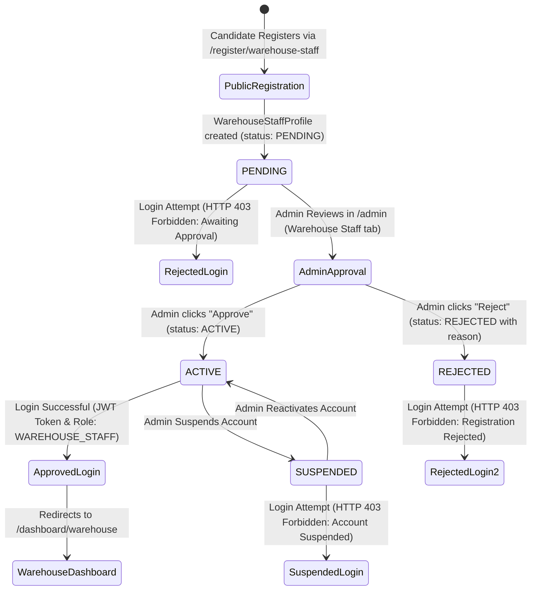

# ShopStack — Warehouse Staff Registration & Approval Lifecycle Guide

This guide details the complete account lifecycle for Warehouse Staff within the ShopStack platform, covering public registration, administrator review & approval, login security guards, and authorization workflows.

---

## 1. Lifecycle Overview

---

## 2. Public Registration Workflow

1. **Candidate Access**: Prospective warehouse employees navigate to the dedicated registration portal:
   `http://localhost:5173/register/warehouse-staff`
2. **Registration Fields**:
   - First Name & Last Name
   - Corporate or Personal Email
   - Phone Number
   - Preferred Warehouse Facility (optional dropdown)
   - Secure Password ($\ge 8$ characters)
3. **Backend Action**:
   - Creates a `User` entity with `role = WAREHOUSE_STAFF`.
   - Creates a corresponding `WarehouseStaffProfile` with `status = PENDING`.
   - Sends notification to platform administrators.
4. **Candidate Feedback**:
   - Registration success screen displays a confirmation banner explaining that their profile is pending administrator verification.

---

## 3. Administrator Review & Verification Portal

Administrators can navigate to the **Warehouse Staff** tab in the Admin Dashboard (`/admin`):
- **Overview Metrics**: Shows counts of All Staff, Pending Approval, Active Staff, Rejected, and Suspended.
- **Actions Available**:
  - **Approve**: Immediately transitions the candidate to `ACTIVE` status and enables login.
  - **Reject**: Prompts the admin for a mandatory rejection reason (e.g., "Incomplete documentation"), transitions status to `REJECTED`, and stores the audit remarks.
  - **Suspend / Reactivate**: Enables or disables existing active staff credentials without deleting account history.
  - **View Details**: Displays comprehensive registration metadata, assigned facility, reviewer name, and decision timestamps.

---

## 4. Login Security Enforcement & Guard Messages

When a user with `WAREHOUSE_STAFF` role attempts to log in (`POST /api/auth/login`), the authentication pipeline verifies their `WarehouseStaffProfile`:

| Profile Status | HTTP Status | Response Message / Action |
|---|---|---|
| `PENDING` | `403 Forbidden` | `"Your Warehouse Staff account is awaiting administrator approval. You will be able to log in once an admin verifies and activates your profile."` |
| `REJECTED` | `403 Forbidden` | `"Your Warehouse Staff registration was rejected. Reason: <rejectionReason>"` |
| `SUSPENDED` | `403 Forbidden` | `"Your Warehouse Staff account is currently suspended. Please reach out to the platform administration."` |
| `ACTIVE` | `200 OK` | Generates JWT token with claims `role: WAREHOUSE_STAFF`, redirects to `/dashboard/warehouse`. |
