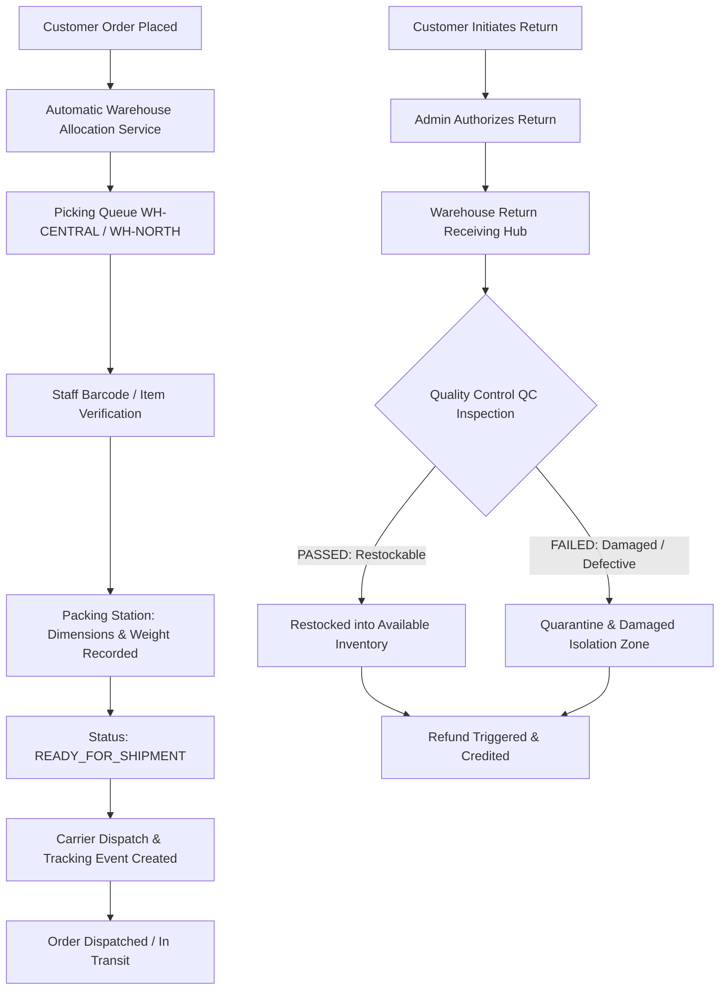

# ShopStack — Complete Professional Warehouse Operations & Fulfillment Workflow

This document outlines the end-to-end warehouse fulfillment and reverse logistics operations implemented in the ShopStack Enterprise Multi-Vendor E-Commerce Platform.

---

## 1. Architectural Architecture & Core Entities

ShopStack integrates a multi-facility distribution network designed for high-throughput fulfillment and accurate inventory traceability.

---

## 2. Order Fulfillment Workflow (Outbound Logistics)

### Step 1: Intelligent Multi-Facility Allocation
- When an order is placed, the `WarehouseAllocationService` evaluates proximity, stock levels, and warehouse capacity across registered facilities (`WH-CENTRAL`, `WH-NORTH-01`, etc.).
- Line items are assigned to appropriate fulfillment facilities, and stock is reserved (`RESERVED_FOR_ORDER` stock movement).

### Step 2: Picking Station & Verification
- Warehouse staff access the **Picking Queue** on the Warehouse Dashboard (`/dashboard/warehouse`).
- Staff locate items via specific Bin / Zone locations (e.g., `Aisle 3, Shelf B, Bin 12`).
- Staff verify each item SKU and quantity before confirming picking.

### Step 3: Packing Station & Dimension/Weight Capture
- Staff transfer picked items to the **Packing Station**.
- Package weight (kg), box dimensions ($L \times W \times H$ in cm), and package material types are entered.
- Package is sealed and marked `READY_FOR_SHIPMENT`.

### Step 4: Dispatch Handover & Shipment Tracking
- Shipping labels and carrier manifests are generated.
- When courier carriers scan the package, staff trigger carrier handover.
- Real-time tracking event logs are written to the database (`PICKED_UP`, `IN_TRANSIT`, `OUT_FOR_DELIVERY`, `DELIVERED`).

---

## 3. Reverse Logistics & Returns Management (Inbound Logistics)

### Step 1: Return Receiving
- Authorized customer returns arrive at designated return hubs.
- Staff scan the return tracking ID or return reference number to verify contents against the customer's return request.

### Step 2: Quality Control (QC) Inspection
- Every returned item undergoes mandatory physical condition evaluation:
  1. **ACCEPTED / PASS**: Item is in brand-new or resalable condition with intact tags/packaging.
  2. **DAMAGED / FAIL**: Item is worn, broken, or tampered.

### Step 3: Isolated Damaged Quarantine vs. Restock
- **Passed Items**: Automatically increment the available warehouse inventory (`STOCK_RESTOCK` audit trail).
- **Damaged Items**: Placed into the **Damaged Quarantine Zone** (`DAMAGED_ISOLATION` audit trail) and prevented from ever being sold to customers again.
- **Refund Automation**: Both inspection outcomes notify the payment gateway to process the appropriate customer refund.
